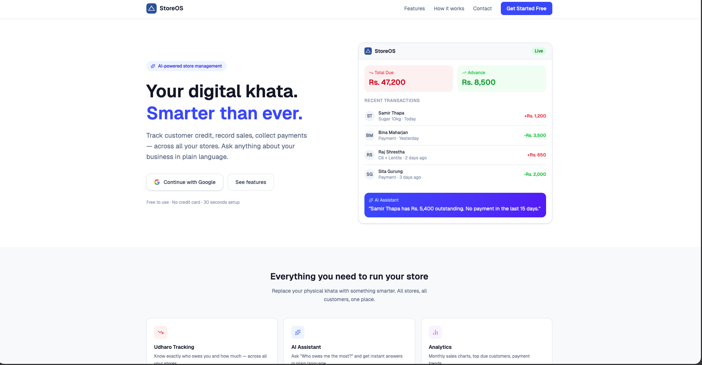
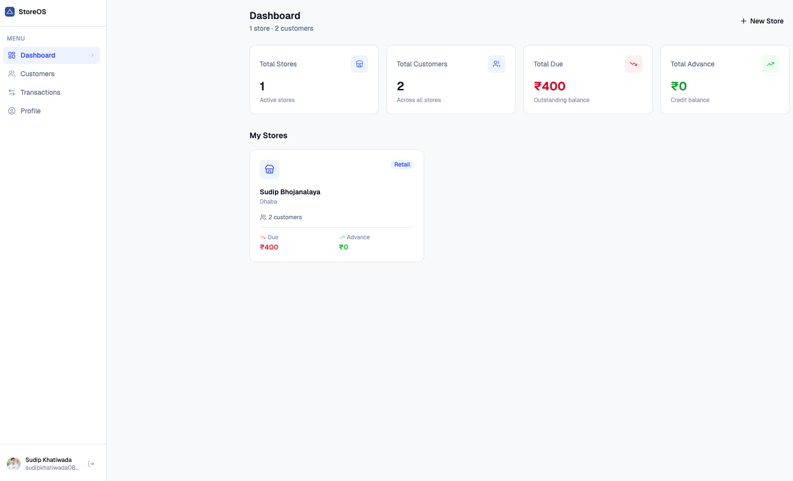
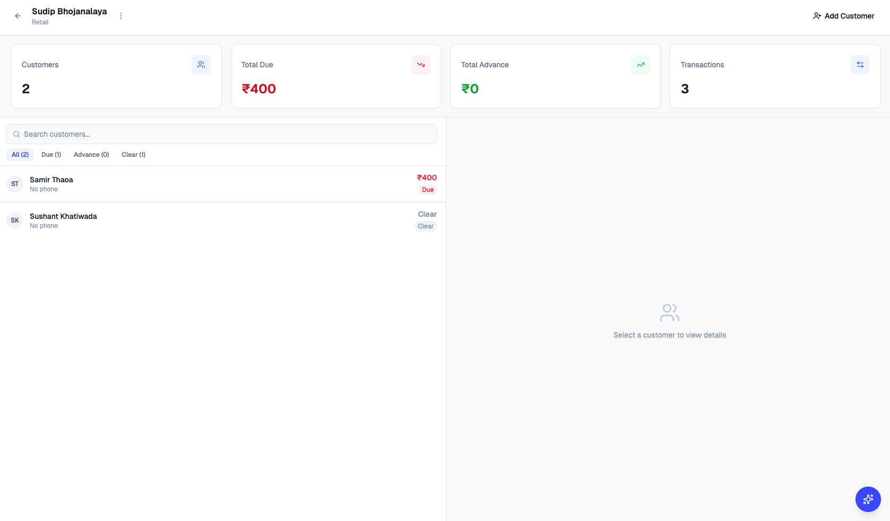
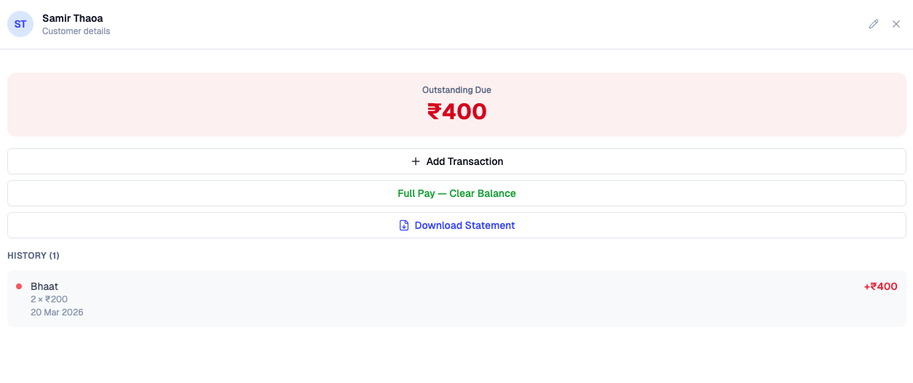
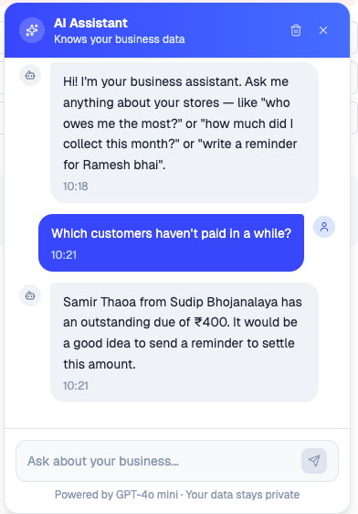
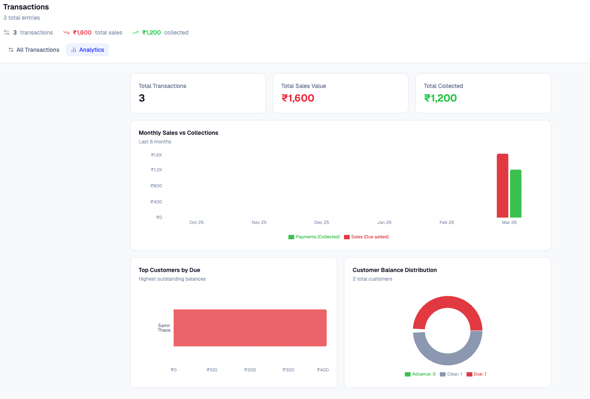

# StoreOS — Smart Store Management

<div align="center">


**A multi-tenant SaaS for managing stores, customers, and credit transactions.**  
Built for small business owners to track who owes them money — powered by AI.

[](https://store-os.vercel.app)
[](https://github.com/ksudip17/STORE_OS)
[](https://nextjs.org)
[](https://typescriptlang.org)
[](https://supabase.com)

</div>

---

## Overview

StoreOS replaces the physical **khata** (ledger) used by small shop owners in Nepal and India. It tracks customer credit (udharo), records sales and payments, and uses AI to answer questions about your business in plain language.

> "Who owes me the most?" → AI answers instantly with real data from your stores.

---

## Screenshots

| Landing Page | Dashboard | Store Detail |
|---|---|---|
|  |  |  |

| Customer Panel | AI Assistant | Analytics |
|---|---|---|
|  |  |  |

---

## Features

- **Multi-store management** — create and manage multiple store locations from one account
- **Customer credit tracking** — track who owes you (due) and who paid ahead (advance)
- **Sale and payment transactions** — qty × rate auto-calculation, full pay in one click
- **AI business assistant** — powered by Groq (LLaMA 3.3 70B), answers natural language questions about your actual business data
- **Real-time updates** — balances update live across all sessions via Supabase Realtime
- **Analytics dashboard** — monthly revenue charts, top due customers, balance distribution
- **PDF statement export** — per-customer account statements with full transaction history
- **Opening balance** — add existing customers with their pre-existing due or advance
- **Secure multi-tenancy** — Row Level Security ensures users only see their own data

---

## Tech Stack

| Layer | Technology |
|-------|-----------|
| Framework | Next.js 16 (App Router) |
| Language | TypeScript (strict mode) |
| Styling | Tailwind CSS + Shadcn UI |
| Database | Supabase (PostgreSQL) |
| Auth | Supabase Auth (Google OAuth) |
| Security | Row Level Security (RLS) |
| State | Zustand |
| Forms | React Hook Form + Zod |
| AI | Groq — LLaMA 3.3 70B |
| Real-time | Supabase Realtime (postgres_changes) |
| Charts | Recharts |
| PDF | @react-pdf/renderer |
| Deployment | Vercel |

---

## Architecture

### Security — 5 Layers

```
Request
  │
  ├── 1. Middleware (Edge) — refreshes session cookies on every request
  │
  ├── 2. Layout Guard (Server) — supabase.auth.getUser() blocks unauthenticated access
  │
  ├── 3. Ownership Check (Server Actions) — verifies store belongs to current user
  │
  ├── 4. RLS Policies (Database) — Postgres enforces data isolation per user
  │
  └── 5. Trigger Validation — balance updates handled by DB triggers, not client
```

Even if someone bypasses the UI and makes a direct API call, the database refuses to return data that doesn't belong to them.

### Server / Client Component Split

```
page.tsx (Server Component)
  │  fetches data server-side — no useEffect, no loading waterfalls
  │
  ├── StatCard (Server) — pure display
  ├── StoreCard (Server) — pure display  
  ├── DashboardHeader (Client) — contains Dialog (Radix needs client boundary)
  └── DashboardRealtime (Client) — thin wrapper, just adds websocket subscription
```

### AI Context Pattern

```
User asks question
  │
  ├── API route fetches all user's data from Supabase (server-side, never exposed to client)
  │     stores, customers, transactions, balances, monthly totals
  │
  ├── Builds rich system prompt with business context
  │
  └── Sends to Groq — model answers with specific names, amounts, dates
```

---

## Database Schema

```sql
profiles        → extends auth.users (full_name, avatar_url)
stores          → user_id FK, name, type, description
customers       → store_id FK, name, phone, address, balance
transactions    → customer_id FK, type (sale/payment), amount, product, qty, rate, date
```

**Key trigger:** `update_customer_balance()` — fires on every transaction insert, automatically updates customer balance. Sale subtracts, payment adds. Balance never gets out of sync.

---

## Getting Started

### Prerequisites

- Node.js 18+
- A [Supabase](https://supabase.com) account
- A [Groq](https://console.groq.com) account (free)
- A Google Cloud project with OAuth credentials

### Installation

```bash
git clone https://github.com/ksudip17/STORE_OS
cd STORE_OS
npm install
```

### Environment Variables

Create `.env.local`:

```env
NEXT_PUBLIC_SUPABASE_URL=https://your-project.supabase.co
NEXT_PUBLIC_SUPABASE_ANON_KEY=your_anon_key
SUPABASE_SERVICE_ROLE_KEY=your_service_role_key
GROQ_API_KEY=gsk_your_groq_key
NEXT_PUBLIC_SITE_URL=http://localhost:3000
```

### Database Setup

Run the SQL schema in your Supabase SQL editor:

```bash
# Schema file is at
supabase/schema.sql
```

Or copy the schema from the [Supabase setup section](#) in the docs.

### Run Locally

```bash
npm run dev
```

Open [http://localhost:3000](http://localhost:3000)

---

## Deployment

This app is deployed on Vercel. To deploy your own:

1. Push to GitHub
2. Import repo in [Vercel](https://vercel.com)
3. Add all 5 environment variables
4. Set Supabase redirect URLs:
   - Site URL: `https://your-app.vercel.app`
   - Redirect URL: `https://your-app.vercel.app/auth/callback`

---

## Project Structure

```
src/
├── app/
│   ├── (auth)/                 # Landing + login page
│   ├── (dashboard)/            # Protected routes
│   │   ├── dashboard/          # Main overview
│   │   ├── store/[storeId]/    # Store detail + customers
│   │   ├── customers/          # All customers across stores
│   │   ├── transactions/       # All transactions + analytics
│   │   └── profile/            # User profile
│   ├── api/ai/                 # Groq AI endpoint
│   └── auth/callback/          # OAuth callback handler
├── components/
│   ├── customer/               # Customer dialogs, panel, PDF
│   ├── store/                  # Store cards, actions menu
│   └── shared/                 # Sidebar, stats, AI chat, logo
├── lib/
│   ├── actions/                # Server actions (Supabase CRUD)
│   ├── supabase/               # Client, server, middleware
│   ├── types.ts                # TypeScript interfaces
│   └── utils.ts                # cn, formatCurrency, getInitials
└── hooks/
    ├── useAIChat.ts            # AI chat state management
    └── useRealtime.ts          # Supabase realtime subscriptions
```

---

## What I Learned

Building this project gave me hands-on experience with:

- **Next.js App Router** — server components, server actions, route groups, dynamic routes
- **Multi-tenancy** — designing RLS policies that scale, ownership verification at every layer
- **Real-time architecture** — Supabase postgres_changes with proper cleanup on unmount
- **AI integration** — building context from relational data, conversation history, prompt engineering
- **TypeScript strict mode** — catching runtime bugs at compile time, proper type narrowing
- **PDF generation** — react-pdf with custom layouts and dynamic data
- **Production deployment** — environment variables, OAuth redirect flows, build optimization

---

## Roadmap (v2)

- [ ] Quick entry mode — record a sale in 3 taps
- [ ] WhatsApp reminder — one-click payment reminder via WhatsApp Web
- [ ] Khata view — physical ledger-style transaction history
- [ ] Offline support — PWA with local storage sync
- [ ] Hindi/Nepali UI — localization for regional users
- [ ] Stripe billing — freemium model with store limits

---

## About

Built by **Sudip Khatiwada** — a CS student from Nepal passionate about building real products that solve real problems.

[](https://linkedin.com/in/sudipkhatiwada)
[](https://github.com/ksudip17)

---

<div align="center">
  <sub>Built with Next.js · Supabase · Groq AI · Deployed on Vercel · Made in Nepal 🇳🇵</sub>
</div>